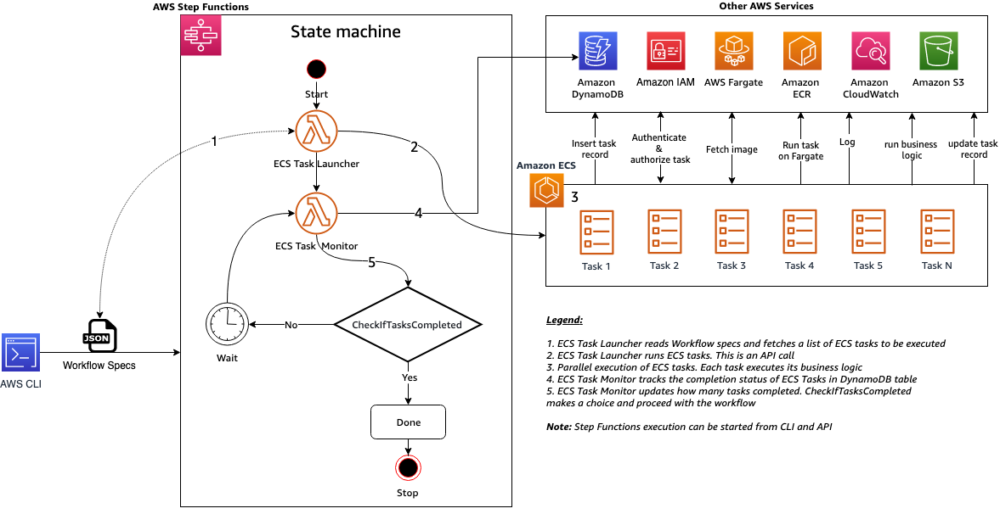
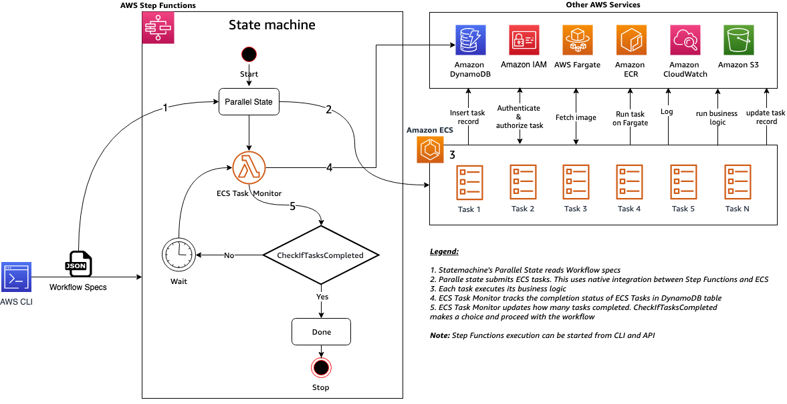
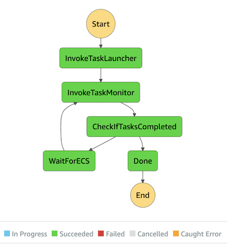
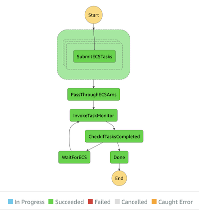

# Amazon ECS and AWS Step Functions Design Patterns Starter kit

This starter kit demonstrates how to run [Amazon Elastic Container Service](https://aws.amazon.com/ecs/) (ECS) tasks using [AWS Step Functions](https://aws.amazon.com/step-functions/). We will present following design patterns:

 1. ECS task submission from AWS Lambda
 1. ECS task submission from Step Functions State Machine using native service integration

We use [AWS Cloud Development Kit](https://aws.amazon.com/cdk/) (CDK) to deploy application resources.

---

## Contents

* [Prerequisites](#prerequisites)
* [ECS Task Business Logic](ecs-task-business-logic)
* [Architecture for ECS task submission from AWS Lambda (Pattern 1)](#architecture-for-ecs-task-submission-from-aws-lambda-pattern-1)
* [Architecture for ECS task submission from AWS Step Functions (Pattern 2)](#architecture-for-ecs-task-submission-from-aws-step-functions-pattern-2)
* [AWS CDK Stacks](#aws-cdk-stacks)
* [Workflow Components](#workflow-components)
* [AWS Components](#aws-components)
* [DynamoDB Tables](#dynamoDB-tables)
* [Build Instructions](#build-instructions)
* [Deployment Instructions](#deployment-instructions)
* [Testing Instructions](#testing-instructions)
* [Cleanup](#cleanup)
* [Contributors](#contributors)

---

## Prerequisites

 1. Docker software is installed on your MacBook / Laptop
 1. Docker daemon is running
 1. You have AWS account credentials

---

## ECS Task Business Logic

Using an Amazon ECS task, we will copy an S3 object from one location to another location in an Amazon S3 bucket. The business logic required to do s3 copy operation is packaged as a Docker image, uploaded to [Amazon Elastic Container Registry](https://aws.amazon.com/ecr/), and run as an ECS Task.

---

## Architecture for ECS task submission from AWS Lambda (Pattern 1)



---

## Architecture for ECS task submission from AWS Step Functions (Pattern 2)



---

## AWS CDK Stacks

[CdkApp](./amazon-ecs-java-starter-kit-cdk/src/main/java/software/aws/ecs/java/starterkit/cdk/CdkApp.java) runs the following stacks

  | Stack Name    | Purpose   |
  |---------------| --------- |
  | [ECSTaskSubmissionFromLambdaPattern](./amazon-ecs-java-starter-kit-cdk/src/main/java/software/aws/ecs/java/starterkit/cdk/ECSTaskSubmissionFromLambdaPattern.java)         | This stack provisions resources needed to demonstrate Pattern 1 |
  | [ECSTaskSubmissionFromStepFunctionsPattern](./amazon-ecs-java-starter-kit-cdk/src/main/java/software/aws/ecs/java/starterkit/cdk/ECSTaskSubmissionFromStepFunctionsPattern.java)  | This stack provisions resources needed to demonstrate Pattern 2 |

---

## Workflow Components

  | Component    | Type |  Purpose   |
  |----------| ------ | ------------ |
  | Workflow specs  | JSON File | A JSON file with workflow specifications to trigger the workflow |
  | Workflow | AWS Step Functions State machine | ECS workflow written in [Amazon States Language](https://docs.aws.amazon.com/step-functions/latest/dg/concepts-amazon-states-language.html)  |
  | ECSTaskLauncher | AWS Lambda | Lambda function to submit ECS Tasks. **Note:** this is only applicable for ECS task submission from AWS Lambda - Pattern 1. |
  | ECSTask | ECS Task | A containerized job (process) runs as a task on Amazon ECS |
  | ECSTaskMonitor  | AWS Lambda | Lambda function to submit ECS Tasks |

---

### AWS Components

  | Component |  Purpose   |
  |-----------|  --------- |
  | Amazon VPC | A dedicated Amazon Virtual Private Cloud (Amazon VPC) to deploy resources. |
  | Subnets    | The required subnets  |
  | Security Groups | The required subnets |
  | VPC Endpoints   | VPC endpoints for Amazon S3  and Amazon  DynamoDB |
  | ECS Cluster | Amazon ECS cluster |
  | ECR Repository | Amazon ECS container registry to store Docker images for ECS task executable |
  | ECS Task Definition | ECS Task definition |
  | Step Function State machine | State machine workflow |
  | S3 bucket       | Amazon S3 bucket used by Amazon ECS task |
  | DynamoDB Tables | DynamoDB tables used for auditing and tracking. See next section. |

### DynamoDB Tables

  | Table    | Schema |  Capacity   |
  |----------| ------ | ----------- |
  | workflow_summary | Partition key = workflow_name (String), Sort key = workflow_run_id (Number) | Provisioned read capacity units = 5, Provisioned write capacity units = 5  |
  | workflow_details | Partition key = workflow_run_id (Number), Sort key = ecs_task_id (String) | Provisioned read capacity units = 5, Provisioned write capacity units = 5 |

---

## Build Instructions

1. Clone this repository to your Mac/Laptop

1. Open your IDE for e.g. [Eclipse](https://www.eclipse.org/) or [Spring Tools](https://spring.io/tools) or [Intellij IDEA](https://www.jetbrains.com/idea/)

1. Import the project as a Maven project by pointing to ```<Path_to_cloned_repo>/Amazon-ecs-java-starter-kit/pom.xml``` | This imports 4 module projects.

1. Select parent project **Amazon-ecs-java-starter-kit** and build it using the below instructions

    1. Using standalone Maven, go to project home directory and run command ```mvn -X clean install```
    1. From Eclipse or STS, run command ```-X clean install```. Navigation: Project right click --> Run As --> Maven Build (Option 4)

1. Expected output 1: In your IDE, you will see the following output

    ```bash
    [INFO] Reactor Summary for amazon-ecs-java-starter-kit 1.0:
    [INFO] 
    [INFO] amazon-ecs-java-starter-kit ........................ [SUCCESS [  0.717 s]
    [INFO] amazon-ecs-java-starter-kit-cdk .................... [SUCCESS [ 14.230 s]
    [INFO] amazon-ecs-java-starter-kit-tasklauncher ........... [SUCCESS [  8.418 s]
    [INFO] amazon-ecs-java-starter-kit-task ................... [SUCCESS [ 21.857 s]
    [INFO] amazon-ecs-java-starter-kit-taskmonitor ............ [SUCCESS [  4.587 s]
    [INFO] ------------------------------------------------------------------------
    [INFO] BUILD SUCCESS
    [INFO] ------------------------------------------------------------------------
    [INFO] Total time:  49.979 s
    [INFO] Finished at: 2020-12-21T13:03:30-06:00
    ```

1. Expected output 2: Build process generates the following jar file  in their respective directories

   | Module artifact name                        | Approximate Size |
   |--------------------------------------------------------|-------|
   | ```amazon-ecs-java-starter-kit-cdk-1.0.jar```          | 32 KB |
   | ```amazon-ecs-java-starter-kit-tasklauncher-1.0.jar``` | 21 MB |
   | ```amazon-ecs-java-starter-kit-task-1.0.jar```         | 19 MB |
   | ```amazon-ecs-java-starter-kit-taskmonitor-1.0.jar```  | 21 MB |

---

## Deployment Instructions

 1. In the terminal, go to path ```/<Path_to_your_cloned_rep>/Amazon-ecs-java-starter-kit/amazon-ecs-java-starter-kit-cdk```

 1. Replace **1234567890** with your AWS Account Id wherever applicable in the following steps.
 
 1. Set these to your account and region

    ```bash
    export AAWS_ACCOUNT_ID=1234567890
    export AWS_REGION=us-east-2
    ```

 1. Bootstrap CDK

    ```bash
    cdk bootstrap aws://${AAWS_ACCOUNT_ID}/$AWS_REGION
    ```

 1. Deploy both stacks
  
    ```bash
    cdk deploy --require-approval never --all --outputs-file outputs.json
    ```

 1. Edit the below files based on the contents from ```/<Path_to_your_cloned_rep>/Amazon-ecs-java-starter-kit/amazon-ecs-java-starter-kit-cdk/outputs.json```

    1. [workflow_specs_pattern_1.json]()
    1. [workflow_specs_pattern_2.json]()

 1. Copy jar files to S3 Bucket for Pattern 1

    ```bash
    aws s3 cp ../amazon-ecs-java-starter-kit-tasklauncher/target/amazon-ecs-java-starter-kit-tasklauncher-1.0.jar s3://${AWS_ACCOUNT_ID}-amazon-ecs-java-starter-kit-pattern-1-bucket/amazon_ecs_java_starter_kit_jar/
    ```

 1. Copy jar files to S3 Bucket for Pattern 2

    ```bash
    aws s3 cp ../amazon-ecs-java-starter-kit-tasklauncher/target/amazon-ecs-java-starter-kit-tasklauncher-1.0.jar s3://${AWS_ACCOUNT_ID}-amazon-ecs-java-starter-kit-pattern-2-bucket/amazon_ecs_java_starter_kit_jar/amazon-ecs-java-starter-kit-tasklauncher-1.0.jar
    ```

---

## Testing Instructions

1. Make sure you are still in the path ```/<Path_to_your_cloned_rep>/Amazon-ecs-java-starter-kit/amazon-ecs-java-starter-kit-cdk```

1. **Start Step Functions execution for Pattern 1**

   ```bash
   aws stepfunctions start-execution --state-machine-arn "arn:aws:states:${AWS_REGION}:${AWS_ACCOUNT_ID}:stateMachine:amazon-ecs-java-starter-kit-pattern-1" --input "$(cat workflow_specs_pattern_1.json )"
   ```

1. Expected  output 1:

   ```bash
   {
    "executionArn": "arn:aws:states:us-east-2:1234567890:execution:amazon-ecs-java-starter-kit-pattern-1:4ea1f256-a0bb-4692-b63a-6b80edc02cb7",
    "startDate": "2020-12-21T09:54:29.385000-06:00"
   }
   ```

1. Expected output 2: When everything goes well, your State machine execution status will be successful as follows.

    

1. Expected output 3: Under S3 URI ```s3://1234567890-amazon-ecs-java-starter-kit-pattern-1-bucket/amazon_ecs_java_starter_kit_jar/```, you will see a total of 11  objects. One of them is the input **amazon-ecs-java-starter-kit-tasklauncher-1.0.jar** and 10 are its copies created by ECS Tasks.

1. **Start Step Functions execution for Pattern 2**

   ```bash
   aws stepfunctions start-execution --state-machine-arn "arn:aws:states:${AWS_REGION}:${AWS_ACCOUNT_ID}:stateMachine:amazon-ecs-java-starter-kit-pattern-2" --input "$(cat workflow_specs_pattern_2.json )"
   ```

1. Expected  output 1:

   ```bash
   {
    "executionArn": "arn:aws:states:us-east-2:1234567890:execution:amazon-ecs-java-starter-kit-pattern-2:17e02b1f-636b-4ffc-b061-96c9ab8e27db",
    "startDate": "2020-12-21T10:16:30.717000-06:00"
   }
   ```

1. Expected output 2: When everything goes well, your State machine execution status will be successful as follows.

    

1. Expected output 3: Under S3 URI ```s3://1234567890-amazon-ecs-java-starter-kit-pattern-2-bucket/amazon_ecs_java_starter_kit_jar/```, you will see a total of 11  objects. One of them is the input **amazon-ecs-java-starter-kit-tasklauncher-1.0.jar** and 10 are its copies created by ECS Tasks.

---

## Cleanup

1. Make sure you are still in the path ```/<Path_to_your_cloned_rep>/Amazon-ecs-java-starter-kit/amazon-ecs-java-starter-kit-cdk```

1. Cleanup DDB Tables - Pattern 1

    ```bash
    ./delete_ddb_items.sh workflow_details_pattern_1 workflow_summary_pattern_1
    ```

1. Cleanup DDB Tables - Pattern 2

    ```bash
    ./delete_ddb_items.sh workflow_details_pattern_2 workflow_summary_pattern_2
    ```

1. Cleanup S3 Bucket of copied objects - Pattern 1

    ```bash
    aws s3 ls s3://${AWS_ACCOUNT_ID}-amazon-ecs-java-starter-kit-pattern-1-bucket/amazon_ecs_java_starter_kit_jar/ | grep _ | awk '{print $NF}' | while read OBJ; do aws s3 rm s3://${AWS_ACCOUNT_ID-}amazon-ecs-java-starter-kit-pattern-2-bucket/amazon_ecs_java_starter_kit_jar/$OBJ;done
    ```

1. Cleanup S3 Bucket of copied objects - Pattern 2

    ```bash
    aws s3 ls s3://${AWS_ACCOUNT_ID-}-amazon-ecs-java-starter-kit-pattern-2-bucket/amazon_ecs_java_starter_kit_jar/ | grep _ | awk '{print $NF}' | while read OBJ; do aws s3 rm s3://${AWS_ACCOUNT_ID-}amazon-ecs-java-starter-kit-pattern-2-bucket/amazon_ecs_java_starter_kit_jar/$OBJ;done
    ```

1. Cleanup S3 Buckets - Pattern 1

    ```bash
    aws s3 rm s3://${AWS_ACCOUNT_ID-}amazon-ecs-java-starter-kit-pattern-1-bucket/amazon_ecs_java_starter_kit_jar/amazon-ecs-java-starter-kit-tasklauncher-1.0.jar
    ```

1. Cleanup S3 Buckets - Pattern 2

    ```bash
    aws s3 rm s3://${AWS_ACCOUNT_ID-}amazon-ecs-java-starter-kit-pattern-2-bucket/amazon_ecs_java_starter_kit_jar/amazon-ecs-java-starter-kit-tasklauncher-1.0.jar
    ```

1. Delete ECR Repository - Pattern 1

    ```bash
    aws ecr delete-repository --force --repository-name amazon-ecs-java-starter-kit-pattern-1
    ```

1. Delete ECR Repository - Pattern 2

    ```bash
    aws ecr delete-repository --force --repository-name amazon-ecs-java-starter-kit-pattern-2
    ```

1. Cleanup stacks for Pattern 1 and 2

    ```bash
    cdk destroy --force --all
    ```

---

## Contributors

1. **Sarma Palli**, Senior DevOps Cloud Architect, Amazon Web Services
1. **Ravi Itha**, Senior Big Data Consultant, Amazon Web Services

---

## License Summary

This sample code is made available under the MIT license. See the LICENSE file.