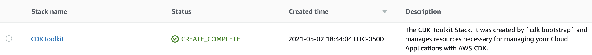
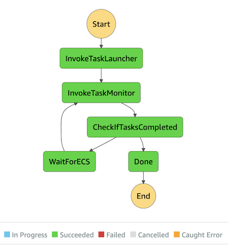
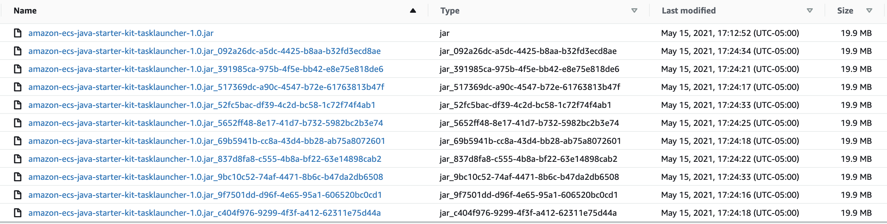

# Amazon ECS and AWS Step Functions Design Patterns Starter kit

This starter kit demonstrates how to run [Amazon Elastic Container Service](https://aws.amazon.com/ecs/) (ECS) tasks using [AWS Step Functions](https://aws.amazon.com/step-functions/). We will implement the following design patterns:

 1. Running ECS tasks using AWS Lambda
 1. Running ECS tasks using Step Functions native integration

We use [AWS Cloud Development Kit](https://aws.amazon.com/cdk/) (CDK) to deploy application resources.

---

## Contents

* [Prerequisites](#prerequisites)
* [Overview](#Overview)
  * [ECS Task Business Logic](#ecs-task-business-logic)
  * [Amazon DynamoDB Tables](#Amazon-dynamoDB-tables)
  * [Workflow Specification](#Workflow-Specification)
  * [AWS CDK Stacks](#aws-cdk-stacks)
* [Patterns](#Patterns)
  * [Pattern 1: Running ECS tasks using AWS Lambda](#Running-ECS-tasks-using-aws-lambda)
  * [Pattern 2: Running ECS tasks using Step Functions native integration](#Running-ECS-tasks-using-Step-Functions-native-integration)
* [Build](#build)
* [Deploy](#deploy)
* [Test](#Test)
  * [Pattern 1: Testing ECS tasks using AWS Lambda](#Testing-ECS-tasks-using-aws-lambda)
  * [Pattern 2: Testing ECS tasks using Step Functions native integration](#Testing-ECS-tasks-using-Step-Functions-native-integration)
* [Cleanup](#cleanup)
* [Contributors](#contributors)

---

## Prerequisites

 1. Docker software is installed on your MacBook / Laptop
 1. Docker daemon is running
 1. You have AWS account credentials

---

## Overview

### ECS Task Business Logic

We run a simple business logic within an ECS task. It creates a copy of the input file in S3 bucket. We will run multiple instances of the task simultaneously.

---

### Amazon DynamoDB Tables

Each pattern requires 2 DynamoDB tables. They are workflow_summary and workflow_details. workflow_summary is used to audit the status of overall workflow execution status. workflow_details is used to audit the status of individual ECS tasks. The schema of the DynamoDB tables is described in the below table.

  | Table    | Schema |  Capacity   |
  |----------| ------ | ----------- |
  | workflow_summary_pattern_x | Partition key = workflow_name (String), Sort key = workflow_run_id (Number) | Provisioned read capacity units = 5, Provisioned write capacity units = 5  |
  | workflow_details_pattern_y | Partition key = workflow_run_id (Number), Sort key = ecs_task_id (String) | Provisioned read capacity units = 5, Provisioned write capacity units = 5 |

  **Note:** here, x and y represent either 1 or 2

---

### Workflow Specification

We create 2 Step Functions State machines to demonstrate the design patterns. State machine is executed with a JSON specs as an input. The specs have two parts - 1) values for ECS cluster, DynamoDB tables, subnets, security groups, S3 bucket etc. 2) list of ECS tasks to run. Table below describes the specs.

 | JSON Attribute  | Description   |
 |-------------------  | ------------- |
 | region         | AWS region used |
 | s3BucketName   | Amazon S3 bucket used demonstrate ECS Task Business Logic |
 | subnetIdLiteral   | List of Subnet Ids separated by a separator |
 | separator         | The separator used in subnetIdLiteral |
 | workflowName      | Name of the workflow name for e.g. ```amazon_ecs_starter_kit-pattern-1``` |
 | securityGroupId   | The security group id used to run ECS tasks |
 | ddbTableNameWFSummary | Name of the DynamoDB table for workflow summary |
 | hashKeyWFSummary  | The hash key of workflow summary table |
 | rangeKeyWFSummary  | The sort key of workflow summary table |
 | ddbTableNameWFDetails  | Name of the DynamoDB table for workflow details |
 | hashKeyWFDetails  | The hash key of workflow details table |
 | rangeKeyWFDetails | The sort key of workflow details table |
 | clusterName    | Name of the ECS cluster |
 | containerName  | Name of the container |
 | taskDefinition | Name of the ECS task definition name |
 | taskList       | It is of type JSON Object and has one more ECS tasks. Each task has three attributes - 1) taskName (Name of the ECS task) 2) s3BucketName (S3 bucket name) 3) objectKey (Object key) |

---

### AWS CDK Stacks

[CdkApp](./amazon-ecs-java-starter-kit-cdk/src/main/java/software/aws/ecs/java/starterkit/cdk/CdkApp.java) runs the following stacks

  | Stack Name    | Purpose   |
  |---------------| --------- |
  | [ECSTaskSubmissionFromLambdaPattern](./amazon-ecs-java-starter-kit-cdk/src/main/java/software/aws/ecs/java/starterkit/cdk/ECSTaskSubmissionFromLambdaPattern.java)         | This stack provisions resources needed to demonstrate Pattern 1 |
  | [ECSTaskSubmissionFromStepFunctionsPattern](./amazon-ecs-java-starter-kit-cdk/src/main/java/software/aws/ecs/java/starterkit/cdk/ECSTaskSubmissionFromStepFunctionsPattern.java)  | This stack provisions resources needed to demonstrate Pattern 2 |

---

## Patterns

### Running ECS tasks using AWS Lambda

As show in the below figure, this pattern (Pattern 1) uses AWS Lambda function to run ECS tasks. We call the Lambda function as **ECS Task Launcher**. It parses workflow specs, submits ECS tasks to ECS Cluster and invokes second AWS Lambda function called **ECS Task Monitor**.

ECS Task Monitor tracks the completion status of running ECS tasks. Each time it runs, it checks the number of completed tasks versus the total number of tasks submitted and updates the DynamoDB table **workflow_summary**.

The task executed on ECS cluster is called **ECS Task**. It takes the following actions - 1) reads input parameters 2) inserts a record in DynamoDB table for auditing 3) copies the input file to a target folder 4) marks the status of its job to Complete in the the DynamoDB table **workflow_detail**.


---

### Running ECS tasks using Step Functions native integration

As shown in the below figure, this pattern (Pattern 2) uses AWS Step Functions' native integration with Amazon ECS. Unlike the usage of a Lambda function in Pattern 1, we use [Parallel state](https://docs.aws.amazon.com/step-functions/latest/dg/amazon-states-language-parallel-state.html) to run ECS tasks. The number of tasks run depends on the size of ```"taskList":[]``` in [workflow_specs_pattern_2.json](./amazon-ecs-java-starter-kit-cdk/workflow_specs_pattern_2.json). The role of ECS Task Monitor and the way ECS Task executes are similar to Pattern 1.


---

## Build

1. Clone this repository to your Mac/Laptop

1. Open your IDE for e.g. [Eclipse](https://www.eclipse.org/) or [Spring Tools](https://spring.io/tools) or [Intellij IDEA](https://www.jetbrains.com/idea/)

1. Import the project as a Maven project by pointing to ```<Path_to_cloned_repo>/Amazon-ecs-java-starter-kit/pom.xml``` | This imports 4 module projects.

1. Select parent project **Amazon-ecs-java-starter-kit** and build it using the below instructions

    1. Using standalone Maven, go to project home directory and run command ```mvn -X clean install```
    1. From Eclipse or STS, run command ```-X clean install```. Navigation: Project right click --> Run As --> Maven Build (Option 4)

1. Expected output 1: In your IDE, you will see the following output

    ```bash
    [INFO] Reactor Summary for amazon-ecs-java-starter-kit 1.0:
    [INFO] 
    [INFO] amazon-ecs-java-starter-kit ........................ [SUCCESS [  0.717 s]
    [INFO] amazon-ecs-java-starter-kit-cdk .................... [SUCCESS [ 14.230 s]
    [INFO] amazon-ecs-java-starter-kit-tasklauncher ........... [SUCCESS [  8.418 s]
    [INFO] amazon-ecs-java-starter-kit-task ................... [SUCCESS [ 21.857 s]
    [INFO] amazon-ecs-java-starter-kit-taskmonitor ............ [SUCCESS [  4.587 s]
    [INFO] ------------------------------------------------------------------------
    [INFO] BUILD SUCCESS
    [INFO] ------------------------------------------------------------------------
    [INFO] Total time:  49.979 s
    [INFO] Finished at: 2020-12-21T13:03:30-06:00
    ```

1. Expected output 2: Build process generates the following jar file  in their respective directories

   | Module artifact name                        | Approximate Size |
   |--------------------------------------------------------|-------|
   | ```amazon-ecs-java-starter-kit-cdk-1.0.jar```          | 32 KB |
   | ```amazon-ecs-java-starter-kit-tasklauncher-1.0.jar``` | 21 MB |
   | ```amazon-ecs-java-starter-kit-task-1.0.jar```         | 19 MB |
   | ```amazon-ecs-java-starter-kit-taskmonitor-1.0.jar```  | 21 MB |

---

## Deploy

 1. In the terminal, go to path ```/<Path_to_your_cloned_rep>/amazon-ecs-and-aws-step-functions-design-patterns-starter-kit/amazon-ecs-java-starter-kit-cdk```. Now, you are in the CDK module of this project.

 1. Replace **1234567890** with your AWS Account Id wherever applicable in the following steps.

 1. Set these to your account and region

    ```bash
    export AWS_ACCOUNT_ID=1234567890
    export AWS_REGION=us-east-2
    ```

 1. Bootstrap CDK

    ```bash
    cdk bootstrap aws://${AWS_ACCOUNT_ID}/$AWS_REGION
    ```

 1. Output 1: In the command line, you will get the following output

    ```bash
    (node:63268) ExperimentalWarning: The fs.promises API is experimental
    ⏳  Bootstrapping environment aws://AWS_ACCOUNT_ID/us-west-2...
    ✅  Environment aws://AWS_ACCOUNT_ID/us-west-2 bootstrapped (no changes).
    ```

 1. Output 2: In the AWS console under CloudFormation, you will see a Stack created as follows

    

 1. Output 3: In the AWS console under S3, you will see a bucket created with name ```cdktoolkit-stagingbucket-*```

 1. Deploy both stacks
  
    ```bash
    cdk deploy --require-approval never --all --outputs-file outputs.json
    ```

 1. Expected output 1: Stack for **amazon-ecs-java-starter-pattern-1** created with the following resources:

    | Resource Type | Resource Details  |
    |---------------|-------------------|
    | VPC           | 1 VPC to launch resources needed by the starter kit |
    | Subnet        | 2 public subnets and 2 private subnets |
    | Route Table   | 1 route table per public, and private subnet |  
    | Security Group | 1 security group per ECR, ECS, and ECS Agent endpoints  |
    | Security Group | 1 security group per ECS Task Launcher and ECS Task Monitor |
    | VPC Endpoint   | 1 VPC endpoint per Amazon DynamoDB, Amazon S3, Amazon ECS, Amazon ECS Agent, and Amazon ECR API. |
    | ECS Cluster    | 1 ECS cluster to run ECS tasks |
    | ECR Repository | 1 ECR repository to store Docker image for ECS Task binary |
    | ECS Task Definition | 1 ECS task definition for ECS Task |  
    | Amazon DynamoDB | 2 tables. Refer to [Amazon DynamoDB Tables](#Amazon-dynamoDB-tables) for more details |
    | Step Functions state machine | 1 State machine for orchestration |
    | AWS Lambda | Lambda Function to submit ECS tasks |
    | AWS Lambda | Lambda Function to monitor the progress of ECS tasks |
    | Amazon IAM Role | 1 IAM role per Step Functions State machine, ECS Task Launcher, ECS Task Monitor. 2 IAM roles for ECS Task Definition - 1) ECS Task Role 2) ECS Task Execution Role |

 1. Expected output 2: Stack for **amazon-ecs-java-starter-pattern-2** created with the following resources:

    | Resource Type | Resource Details  |
    |---------------|-------------------|
    | VPC           | 1 VPC to launch resources needed by the starter kit |
    | Subnet        | 2 public subnets and 2 private subnets |
    | Route Table   | 1 route table per public, and private subnet |  
    | Security Group | 1 security group per ECR, ECS, and ECS Agent endpoints  |
    | Security Group | 1 security group per ECS Task Launcher and ECS Task Monitor |
    | VPC Endpoint   | 1 VPC endpoint per Amazon DynamoDB, Amazon S3, Amazon ECS, Amazon ECS Agent, and Amazon ECR API. |
    | ECS Cluster    | 1 ECS cluster to run ECS tasks |
    | ECR Repository | 1 ECR repository to store Docker image for ECS Task binary |
    | ECS Task Definition | 1 ECS task definition for ECS Task |  
    | Amazon DynamoDB | 2 tables. Refer to [Amazon DynamoDB Tables](#Amazon-dynamoDB-tables) for more details |
    | Step Functions state machine | 1 State machine for orchestration |
    | AWS Lambda | Lambda Function to monitor the progress of ECS tasks |
    | Amazon IAM Role | 1 IAM role per Step Functions State machine, and ECS Task Launcher. 2 IAM roles for ECS Task Definition - 1) ECS Task Role 2) ECS Task Execution Role |

 1. Expected output 3: A file [outputs.json](./amazon-ecs-java-starter-kit-cdk/outputs.json) is created with a list of AWS resource values provisioned by the CDK.

---

## Test

### Testing ECS tasks using AWS Lambda

1. Open file [workflow_specs_pattern_1.json](./amazon-ecs-java-starter-kit-cdk/workflow_specs_pattern_1.json) in your IDE and update JSON attributes based on the values for ```amazon-ecs-java-starter-pattern-1``` of ```outputs.json```.

1. Open your command prompt / Mac terminal

1. Go to path ```/<Path_to_your_cloned_rep>/amazon-ecs-and-aws-step-functions-design-patterns-starter-kit/amazon-ecs-java-starter-kit-tasklauncher/```

1. Copy jar file to S3 bucket. Use the following command

    ```bash
    aws s3 cp ../amazon-ecs-java-starter-kit-tasklauncher/target/amazon-ecs-java-starter-kit-tasklauncher-1.0.jar s3://${AWS_ACCOUNT_ID}-amazon-ecs-java-starter-kit-pattern-1-bucket/amazon_ecs_java_starter_kit_jar/
    ```

1. Go to path ```/<Path_to_your_cloned_rep>/amazon-ecs-and-aws-step-functions-design-patterns-starter-kit/amazon-ecs-java-starter-kit-cdk```

1. Start Step Functions execution. Use the following command

   ```bash
   aws stepfunctions start-execution --state-machine-arn "arn:aws:states:${AWS_REGION}:${AWS_ACCOUNT_ID}:stateMachine:amazon-ecs-java-starter-kit-pattern-1" --input "$(cat workflow_specs_pattern_1.json)"
   ```

1. Expected  output 1: You will get a response as follows

   ```bash
   {
    "executionArn": "arn:aws:states:us-east-2:1234567890:execution:amazon-ecs-java-starter-kit-pattern-1:4ea1f256-a0bb-4692-b63a-6b80edc02cb7",
    "startDate": "2020-12-21T09:54:29.385000-06:00"
   }
   ```

1. Expected output 2: In Step Functions console, state machine ```amazon-ecs-java-starter-kit-pattern-1``` changes to Running state

1. Expected output 3: After a minute or two, your State machine execution status will be successful as follows.

    

1. Expected output 4: In S3 bucket, you will see 10 extra jar files which are copied by ECS task instances.

   

1. Expected output 5:

    | Table    | Number of items | Sample column values |
    |----------| ----------------| ------------- |
    | workflow_summary_pattern_1 | 1 | number_of_tasks = 10, completed_tasks = 10 |
    | workflow_details_pattern_1 | 10 | status = Completed |

### Testing ECS tasks using Step Functions native integration

1. Open file [workflow_specs_pattern_2.json](./amazon-ecs-java-starter-kit-cdk/workflow_specs_pattern_2.json) in your IDE and update JSON attributes based on the values for ```amazon-ecs-java-starter-pattern-2``` of ```outputs.json```.

1. Open your command prompt or Mac terminal

1. Go to path ```/<Path_to_your_cloned_rep>/amazon-ecs-and-aws-step-functions-design-patterns-starter-kit/amazon-ecs-java-starter-kit-tasklauncher/```

1. Copy jar file to S3 bucket. Use the following command

    ```bash
    aws s3 cp ../amazon-ecs-java-starter-kit-tasklauncher/target/amazon-ecs-java-starter-kit-tasklauncher-1.0.jar s3://${AWS_ACCOUNT_ID}-amazon-ecs-java-starter-kit-pattern-2-bucket/amazon_ecs_java_starter_kit_jar/
    ```

1. Go to path ```/<Path_to_your_cloned_rep>/amazon-ecs-and-aws-step-functions-design-patterns-starter-kit/amazon-ecs-java-starter-kit-cdk```

1. Start Step Functions execution. Use the following command

   ```bash
   aws stepfunctions start-execution --state-machine-arn "arn:aws:states:${AWS_REGION}:${AWS_ACCOUNT_ID}:stateMachine:amazon-ecs-java-starter-kit-pattern-1" --input "$(cat workflow_specs_pattern_2.json)"

1. Expected outputs are similar to Pattern 1

---

## Cleanup

1. Go to ```/<Path_to_your_cloned_rep>/Amazon-ecs-java-starter-kit/amazon-ecs-java-starter-kit-cdk```

1. Delete DynamoDB tables

    ```bash
    ./delete_ddb_items.sh workflow_details_pattern_1 workflow_summary_pattern_1
    ```

    ```bash
    ./delete_ddb_items.sh workflow_details_pattern_2 workflow_summary_pattern_2
    ```

1. Empty S3 buckets

    ```bash
    aws s3 ls s3://${AWS_ACCOUNT_ID}-amazon-ecs-java-starter-kit-pattern-1-bucket/amazon_ecs_java_starter_kit_jar/ | grep _ | awk '{print $NF}' | while read OBJ; do aws s3 rm s3://${AWS_ACCOUNT_ID-}amazon-ecs-java-starter-kit-pattern-2-bucket/amazon_ecs_java_starter_kit_jar/$OBJ;done
    ```

    ```bash
    aws s3 ls s3://${AWS_ACCOUNT_ID-}-amazon-ecs-java-starter-kit-pattern-2-bucket/amazon_ecs_java_starter_kit_jar/ | grep _ | awk '{print $NF}' | while read OBJ; do aws s3 rm s3://${AWS_ACCOUNT_ID-}amazon-ecs-java-starter-kit-pattern-2-bucket/amazon_ecs_java_starter_kit_jar/$OBJ;done
    ```

1. Delete S3 buckets

    ```bash
    aws s3 rm s3://${AWS_ACCOUNT_ID-}amazon-ecs-java-starter-kit-pattern-1-bucket/amazon_ecs_java_starter_kit_jar/amazon-ecs-java-starter-kit-tasklauncher-1.0.jar
    ```

    ```bash
    aws s3 rm s3://${AWS_ACCOUNT_ID-}amazon-ecs-java-starter-kit-pattern-2-bucket/amazon_ecs_java_starter_kit_jar/amazon-ecs-java-starter-kit-tasklauncher-1.0.jar
    ```

1. Delete ECR Repositories

    ```bash
    aws ecr delete-repository --force --repository-name amazon-ecs-java-starter-kit-pattern-1
    ```

    ```bash
    aws ecr delete-repository --force --repository-name amazon-ecs-java-starter-kit-pattern-2
    ```

1. Cleanup stacks

    ```bash
    cdk destroy --force --all
    ```

---

## Contributors

1. **Sarma Palli**, Senior DevOps Cloud Architect, Amazon Web Services
1. **Ravi Itha**, Senior Big Data Consultant, Amazon Web Services

---

## License Summary

This sample code is made available under the MIT license. See the LICENSE file.
